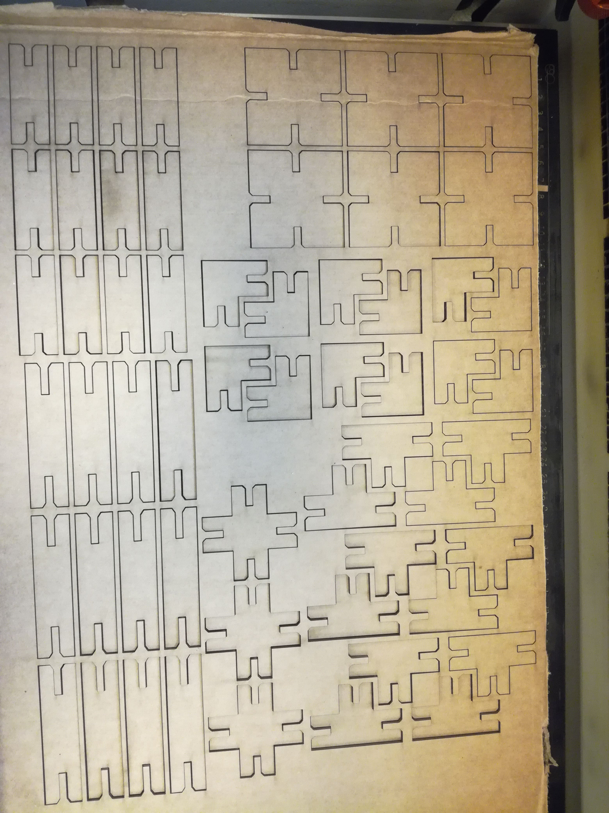

# openscaser
OPENSCAD library for press and fit laser cutting

Contains 3 files for the moment:
* `config.scad` contains all the parametric variable of the project.

* `slots.scad` contains all the module to generate parametric slots and holes.

    This file need to be slit in two or three files (`utils.scad`, `transformations.scad` and `slots.scad`)

* `main.scad` use `slots` to display and export the all thing.
    
    Need to write great parametric functions for displaying and exporting the code in DXF

#### What's next ?
* write functions of diplaying and exporting
* Improve the transformation with external shapes